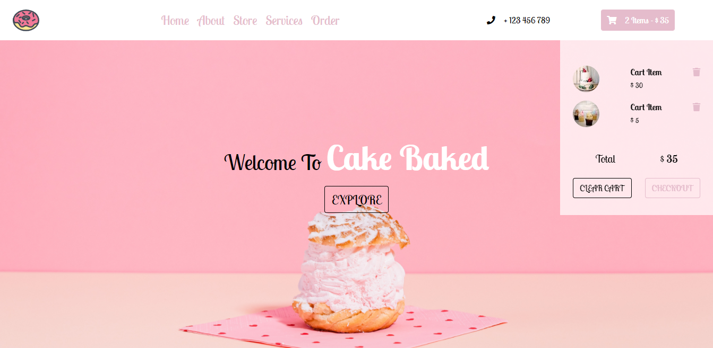
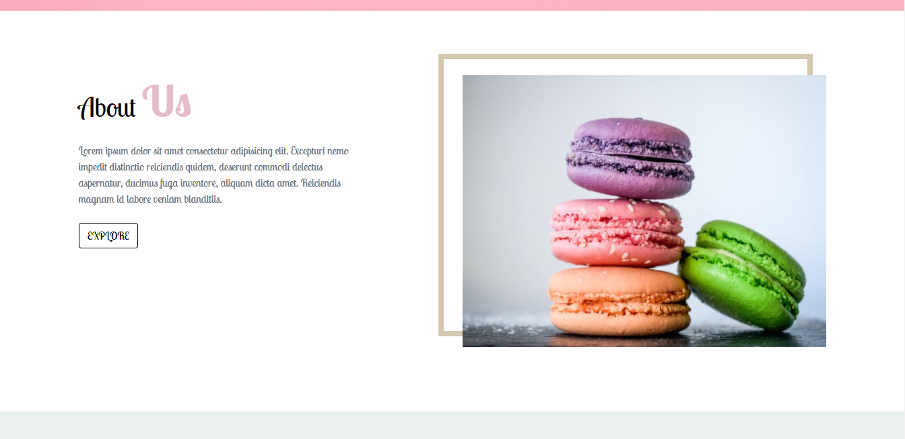
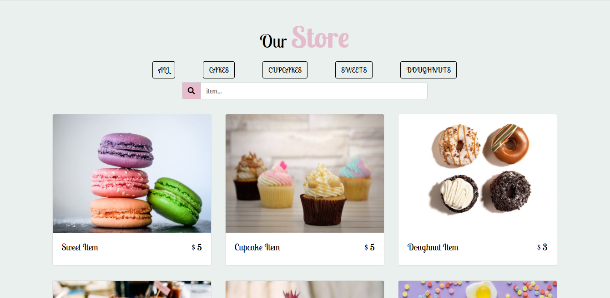
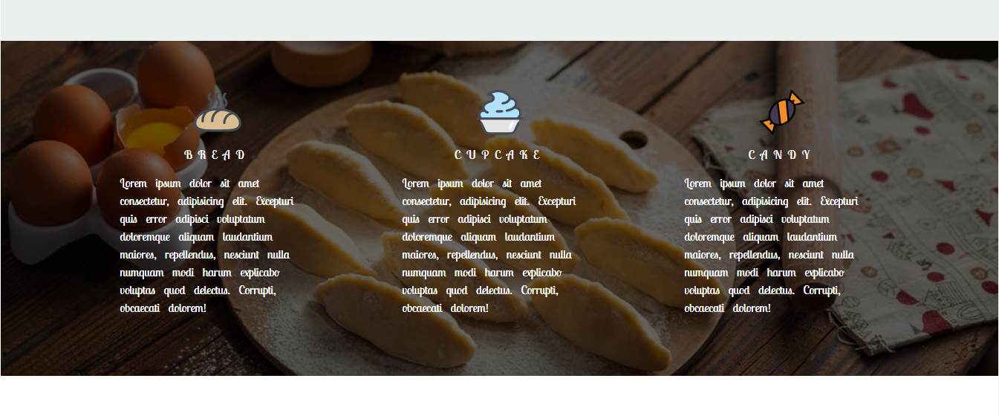
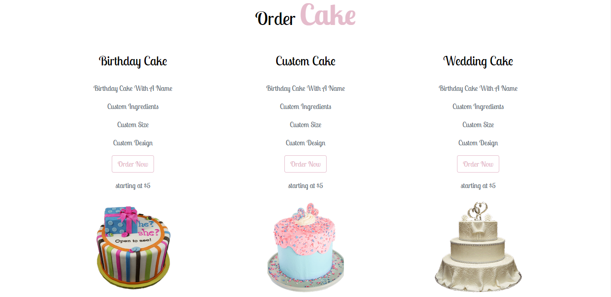
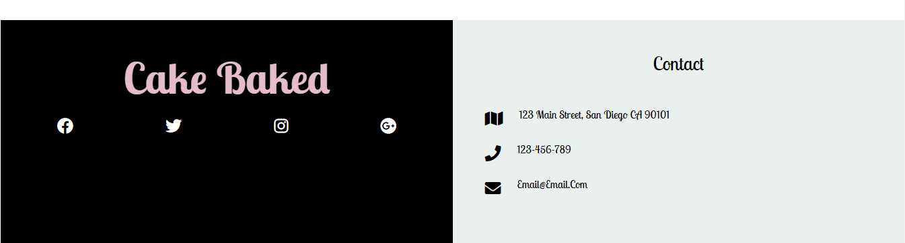

<h1>JavaScript Project: <strong>Cake Baked</strong> (Shopping Cart)</h1>

<h2>Nav & Banner</h2>

 
<h2>About Us</h2>

 
<h2>Store</h2>

 
<h2>Services</h2>

 
<h2>Cakes</h2>

 
<h2>Footer</h2>
